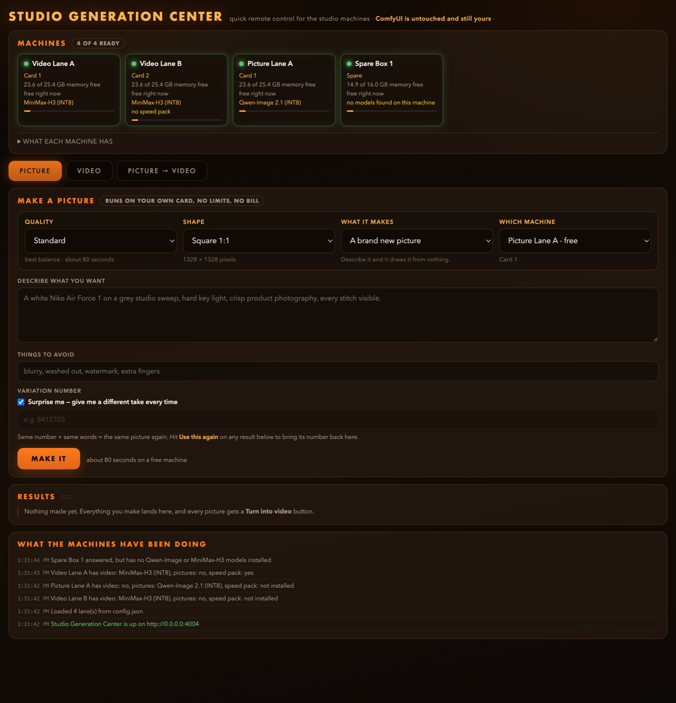
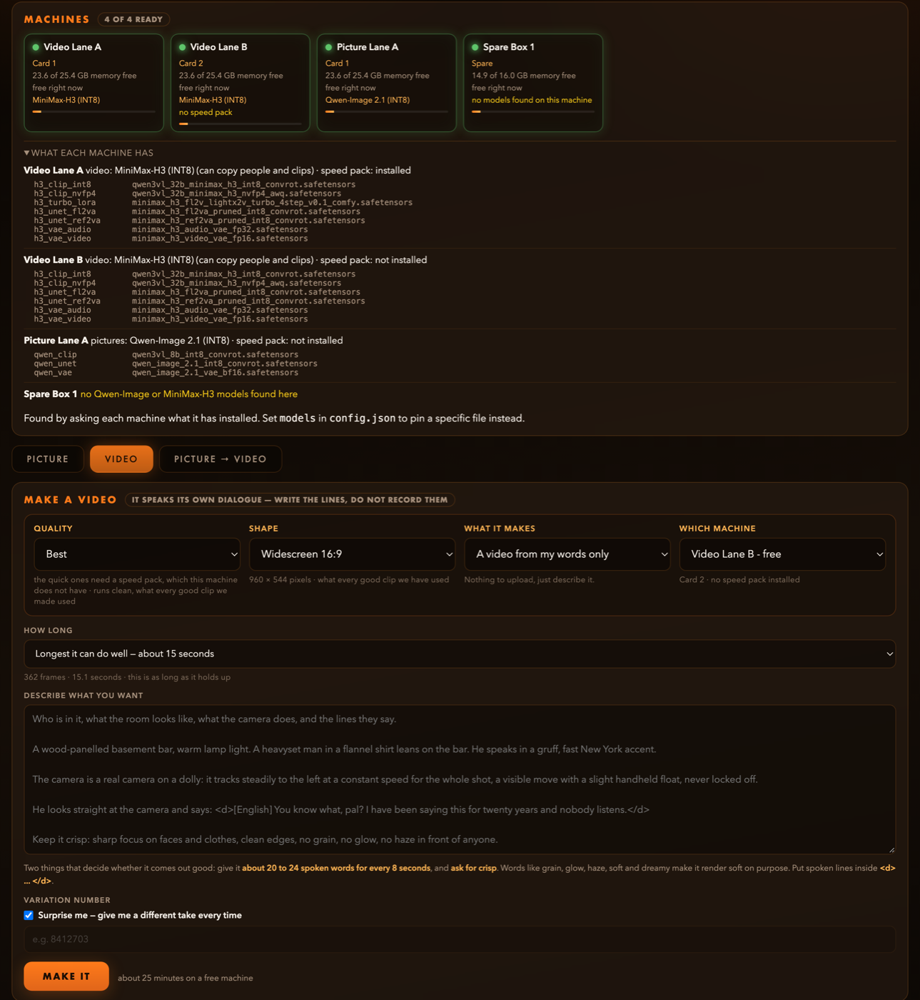

# Studio Generation Center

A plain-language web remote control for a fleet of [ComfyUI](https://github.com/comfyanonymous/ComfyUI)
instances. One Python file, one HTML page, standard library only, no dependencies and no build step.



## Why this exists

ComfyUI is a node graph, and a node graph is the right tool when you are designing something. It is the
wrong tool when someone who is not you wants a picture of a sneaker in thirty seconds, or when you have
four ComfyUI instances on three machines and the real question is just "which card is free right now".

This is a second front door onto the **same** ComfyUI instances. It shows Quality, Shape and "Variation
number" instead of samplers, schedulers and seeds. It shows every lane's live status in one strip, so
nobody has to open four browser tabs to find a free GPU. It frees VRAM automatically when two lanes share
a card, which is the thing that otherwise turns a casual request into an out-of-memory crash. And it
chains a finished still straight into a video as its first frame, across machines, without anyone
touching a file. It never replaces ComfyUI, never restarts it and never reconfigures it. Delete this app
tomorrow and every lane keeps running exactly as it did.

Two model families are wired in:

| Tab | Model | Modes |
|---|---|---|
| **Picture** | Qwen-Image-2.1 | text to image, plus an edit mode that takes up to 10 reference pictures |
| **Video** | MiniMax-H3 | text to video, first/last frame (fl2va), reference images and clips (ref2va) |
| **Picture -> Video** | both | a finished still goes onto a video lane as its first frame, resized to fit |



---

## Prerequisites

1. **One or more ComfyUI instances**, reachable over HTTP from wherever you run this app, each started
   with `--listen` so it is not bound to localhost only. A typical two-GPU box:

   ```bash
   python main.py --listen 0.0.0.0 --port 8188 --cuda-device 0
   python main.py --listen 0.0.0.0 --port 8189 --cuda-device 1
   ```

2. **The models, in the usual ComfyUI folders.** You do not have to tell this app their filenames: it
   asks each lane what it has. Download whichever quantisation suits your cards from the Comfy-Org
   repacks, or use one of the many community quants:

   * Qwen-Image-2.1 (stills): <https://huggingface.co/Comfy-Org/Qwen-Image-2.1>
   * MiniMax-H3 (video and audio): <https://huggingface.co/Comfy-Org/MiniMax-H3>

   | What | Goes in |
   |---|---|
   | Qwen-Image-2.1 diffusion model, its Qwen3-VL text encoder, its VAE | `diffusion_models/`, `text_encoders/`, `vae/` |
   | MiniMax-H3 fl2va and/or ref2va diffusion model | `models/diffusion_models/` |
   | MiniMax-H3 text encoder (a Qwen3-VL 32B fine-tune) | `models/text_encoders/` |
   | MiniMax-H3 video VAE **and** audio VAE (both are needed) | `models/vae/` |
   | MiniMax-H3 4-step turbo LoRA (optional, enables the quick settings) | `models/loras/` |

   You only need the family you intend to use. A lane with only H3 is a video lane, a lane with only
   Qwen-Image is a picture lane, and the app works this out for itself.

3. **The nodes these graphs use.** Recent ComfyUI ships all of them natively. Check that your build has
   `TextEncodeQwenImage21`, `MiniMaxH3ImageToVideo`, `MiniMaxH3ReferenceToVideo`, `CreateVideo`,
   `SaveVideo`, `VAEDecodeAudio`, `GetVideoComponents` and `ModelSamplingAuraFlow`. If one is missing,
   update ComfyUI. See the ComfyUI tutorials for
   [Qwen-Image](https://docs.comfy.org/tutorials/image/qwen/qwen-image) and
   [MiniMax-H3](https://docs.comfy.org/tutorials/video/minimax/minimax-h3).

4. **Python 3** on the machine running this app. That is the whole dependency list. Developed against
   3.9; anything newer is fine. No pip, no venv.

## Quickstart

```bash
git clone https://github.com/YOUR_USER/comfyui-studio-remote.git
cd comfyui-studio-remote

cp config.example.json config.json   # 1. copy the example
$EDITOR config.json                  # 2. put in your own hosts, ports and model filenames
python3 server.py                    # 3. run it
```

4. Open <http://localhost:3998/>.

Addresses are the only thing you have to supply. The example config contains **no model filenames at
all**, because the app reads each lane's installed models from ComfyUI itself and picks the right ones.

Before you edit `config.json`, every lane will glow red and say "offline", because the example points at
`10.0.0.50` and friends, which are not your machines. That is the expected first run and it proves the
config path works. Fill in real addresses and the lanes turn green within about four seconds, each one
reporting what it found:

```
[models] Video Lane A has video: MiniMax-H3 (INT8), pictures: no, speed pack: yes
[models] Picture Lane A has video: no, pictures: Qwen-Image 2.1 (INT8), speed pack: not installed
[models] Spare Box 1 answered, but has no Qwen-Image or MiniMax-H3 models installed
```

There is no install step and nothing is written outside the repo directory: runtime state lives in
`data/`, which is git-ignored.

To keep your config somewhere else, set `GENCENTER_CONFIG=/path/to/config.json`.

### Running it as a service

macOS, `~/Library/LaunchAgents/com.example.generation-center.plist`:

```xml
<key>ProgramArguments</key>
<array>
  <string>/usr/bin/python3</string>
  <string>/path/to/comfyui-studio-remote/server.py</string>
</array>
<key>KeepAlive</key><true/>
```

Linux, a systemd unit with `ExecStart=/usr/bin/python3 /path/to/server.py` does the same job.

> One trap worth knowing: if you also start it by hand from inside the repo, its argv is just
> `server.py`, so `pkill -f "comfyui-studio-remote/server.py"` matches nothing and the stray process
> keeps the port. The service then fails with `Address already in use`. Find it with
> `lsof -nP -iTCP:3998 -sTCP:LISTEN` and kill it by PID.

---

## config.json

Everything machine-specific lives here, and this file is git-ignored. `config.example.json` is the
template.

```jsonc
{
  "title": "Studio Generation Center",   // the page name, shown in the header and the tab
  "port": 3998,                          // the port this app listens on
  "bind": "0.0.0.0",                     // "127.0.0.1" to keep it on the local machine only

  "lanes": [ ... ],                      // one entry per ComfyUI instance, see below
  "status_only": { ... },                // optional extra tile, never dispatched to
  "timing": { ... },                     // optional poll intervals
  "models": { ... }                      // OPTIONAL overrides, see "Model discovery"
}
```

`lanes` is the only part you have to write.

### A lane

One entry per ComfyUI instance. Not per machine: a two-GPU box running two ComfyUI processes is two
lanes.

```jsonc
{
  "id": "video-a",              // unique, stable, used internally and in saved job history
  "name": "Video Lane A",       // what appears on screen and in every message
  "box": "your-box",            // free text, which physical machine it lives on
  "host": "10.0.0.50",          // hostname or IP this app can reach
  "port": 8188,                 // that ComfyUI's port
  "gpu": "your-box:gpu0",       // THE COLLISION KEY, see below
  "gpu_label": "Card 1",        // human name for the card, shown in the UI
  "caps": ["video"],            // ["image"], ["video"], or both
  "note": "video lane",         // shown under the name while the lane is offline
  "shared": "someone else uses this one too"   // optional, shown next to the picker
}
```

Required: **`id`, `name`, `host`, `port`.** Everything else has a default. The shortest useful lane is:

```json
{ "id": "spare-1", "name": "Spare Box 1", "host": "10.0.0.51", "port": 8188 }
```

with `gpu` defaulting to the host (see below), `gpu_label` to the box or host, and `caps` to both, so
the lane offers whatever models it turns out to have. The app validates all of this at start-up and
tells you exactly which lane and which key is wrong rather than failing later with a stack trace.

`caps` is what a lane is **for**, not what it can do. What it can do is discovered. The UI offers the
intersection: declare `["video"]` on a box that also holds Qwen-Image and it stays a video lane.

Every lane is **always** listed in the UI. Offline lanes glow red and are never hidden, so a box that is
down is visibly down rather than silently missing. Add a lane by appending to this list and restarting:
the pollers, the websocket listeners, the machine pickers and the VRAM rule all read from it.

### `gpu` is the collision key, and it is hand-maintained

**Two lanes with the same `gpu` string are treated as sharing one physical card.** The string itself is
arbitrary; only equality matters.

This cannot be detected automatically. A ComfyUI launched with `--cuda-device 1` reports its card as
index 0 inside its own process, so every lane claims to be on GPU 0 and the API cannot tell you
otherwise. Read it off your own launch commands, or off `ps`, and write it down here.

**Leave `gpu` out and it defaults to the lane's host**, which treats every lane on one machine as
sharing one card. That is the deliberately pessimistic guess: on a single-GPU box it is exactly right,
and on a multi-GPU box it costs you an unnecessary model reload rather than an out-of-memory crash. Set
it explicitly once you know which lane is on which card.

Get it wrong in the safe direction (give a shared card two different keys) and you lose the automatic
VRAM clearing, so you get an out-of-memory error where you would have got a wait. Get it wrong the other
way (give two separate cards the same key) and the app pointlessly unloads a model that was not in the
way. The first mistake is the one that costs you a render.

### `status_only` (optional)

A read-only tile in the machine strip for something that is not a ComfyUI lane, for example an LLM server
sharing the same box. It is polled at any OpenAI-compatible `/v1/models` endpoint purely for a green or
red dot, and is never dispatched to. Delete the key and the tile disappears.

---

## Model discovery

**You do not configure model filenames.** The same model ships under a dozen names depending on who
quantised it, so instead of asking you to transcribe strings, each lane is asked what it has:

```
GET /object_info/UNETLoader        -> every diffusion model installed on that lane
GET /object_info/CLIPLoader        -> every text encoder
GET /object_info/VAELoader         -> every VAE
GET /object_info/LoraLoaderModelOnly -> every LoRA
```

Those are the same lists ComfyUI shows in its own loader dropdowns, so they are true by definition. The
app then matches on **patterns**, not exact names. It runs when a lane first answers and every five
minutes after that, so installing a model shows up without restarting anything.

### The patterns

A filename is matched case-insensitively. "must have" terms all have to appear; "must not" rules a file
out; "prefers" only breaks ties.

| Role | Must have | Must not | Prefers |
|---|---|---|---|
| H3 video model (first/last frame, text to video) | `minimax_h3` | `ref2v` | `fl2v`, `t2v` |
| H3 reference model (copy people and clips) | `minimax_h3`, `ref2v` | | |
| H3 text encoder | `qwen3vl`, `minimax_h3` | | `nvfp4`+`awq`, or `int8` |
| H3 video VAE | `minimax_h3` | `audio` | `video` |
| H3 audio VAE | `minimax_h3`, `audio` | | |
| H3 speed LoRA | `minimax_h3`, and one of `turbo` / `4step` / `lightx2v` | | `comfy`, `fl2v` |
| Qwen image model | `qwen_image` | `minimax`, `vae` | `2.1` |
| Qwen text encoder | `qwen3vl` | `minimax` | `8b` |
| Qwen VAE | `qwen_image`, `vae` | `minimax` | |

Three of those deserve an explanation:

* **`minimax_h3`, never bare `minimax`.** MiniMax ship other model families, and a `minimax_music3_*`
  file sitting in the same folder must not be mistaken for a video model.
* **The H3 text encoder carries both `qwen3vl` and `minimax_h3`.** It is a Qwen3-VL fine-tune, which is
  exactly what separates it from the image model's own `qwen3vl` encoder. That is why "must not contain
  `minimax`" appears on the Qwen encoder row.
* **The speed LoRA prefers `comfy`.** A MiniMax LoRA that has not been converted to ComfyUI's
  `diffusion_model.*` key naming loads with no error at all and then does nothing, which is
  indistinguishable from a bad prompt. Preferring the converted build avoids a silent no-op.

When several files match a role, the app prefers a quantisation the card can hold: under about 25 GB of
VRAM it favours `nvfp4` / `int8` / `fp8` / `w4a8` / GGUF over `bf16` / `fp16`, and an unknown card
counts as small. Remaining ties go to the shorter filename, which in practice means the plain build over
a variant.

### What it does with the answer

* A lane with H3 is a **video** lane; a lane with Qwen-Image is a **picture** lane. A lane with neither
  is offered for nothing and says so.
* A lane with the fl2va model but no ref2va model can do text to video and first frame, but "copy people
  and clips" is refused with the reason.
* **No speed LoRA means the 4, 6 and 8 step settings are switched off**, not silently run without it. A
  4-step schedule without its distillation LoRA produces mush, and that is precisely the trap the plain
  language Quality dropdown exists to avoid.
* The machine strip shows what each box has in plain words, with the exact filenames in the hover
  tooltip and in the **What each machine has** expander underneath.

### Overriding it

Pin a specific file whenever you want. Anything named in config wins; anything absent is discovered.

```jsonc
{
  "models": {                                     // global: applies to every lane
    "h3_turbo_lora": "my_preferred_turbo.safetensors"
  },
  "lanes": [
    { "id": "video-a", "name": "Video Lane A", "host": "10.0.0.50", "port": 8188,
      "models": { "h3_clip_nvfp4": "my_encoder.safetensors" } }   // per-lane wins over global
  ]
}
```

The keys are `qwen_unet`, `qwen_clip`, `qwen_vae`, `h3_unet_fl2va`, `h3_unet_ref2va`, `h3_clip_nvfp4`,
`h3_clip_int8`, `h3_vae_video`, `h3_vae_audio` and `h3_turbo_lora`. A key this app does not use is
rejected at start-up rather than ignored, so a typo cannot quietly do nothing. If your filenames are
unusual enough that discovery misses them, either rename the files to include the terms in the table
above, or pin them here.

---

## How the VRAM freeing works

This is the part that earns the app its keep on a multi-GPU box.

H3 holds roughly 20 GB of weights and Qwen-Image roughly 17 GB. A 24 GB card cannot hold both. If a
picture lane and a video lane sit on the same card, the second dispatch is an out-of-memory error unless
something gives.

`free_colliding_lanes()` runs before **every** dispatch:

1. Find every other lane sharing this lane's `gpu` key.
2. `GET /queue` on each one.
   * **Busy?** Refuse the dispatch and say so in plain words, naming another lane that can do the job:
     *"Video Lane A is busy on Card 1 right now, and both jobs will not fit on one card. Try Video Lane B
     instead, or wait about 10 minutes."* The app will **not** yank weights out from under a running
     render. Somebody else's job dying is worse than your job waiting.
   * **Idle?** Read its free VRAM, `POST /free {"unload_models": true, "free_memory": true}`, wait two
     seconds for the driver to actually release, read free VRAM again, and report the delta on screen:
     *"Made room on Card 1: Video Lane A let go of 21.0 GB (24.5 GB free now)."*
3. Dispatch.

`/free` is ComfyUI's own endpoint and it drops model weights only. **The ComfyUI process stays alive**
and answers `/system_stats` a second later. The cost is a 30 to 60 second reload on that lane's next job,
which is the price of never hitting an OOM.

This also fires on the Picture -> Video chain, which is the case that needs it most: the still is made by
Qwen on one card and the video starts on the same card seconds later.

---

## What this app is allowed to do to a lane

The complete list. Everything else is off limits by construction:

| Call | Why |
|---|---|
| `GET /system_stats` | the green/red dot, free VRAM |
| `GET /queue` | jobs waiting, and the busy check in the VRAM rule |
| `GET /history/<prompt_id>` | the authoritative "is it finished" |
| `GET /view?...` | pull a finished file for the gallery and the chain |
| `GET /object_info/<Loader>` | the model list, for discovery: see above |
| `WS /ws?clientId=...` | the live progress percentage |
| `POST /upload/image` | **writes** a reference file into the lane's input folder |
| `POST /prompt` | **writes** a job into the queue |
| `POST /free` | **drops weights**, process untouched |
| `POST /interrupt` | only from the "Stop this one" button |

It never restarts, kills, updates or reconfigures a lane, a container or a model server, and it never
deletes a file it did not create. Removing a result from the gallery drops this app's record of it; the
file stays on the lane's disk.

Your lanes may be running someone else's production work. This app is written to be a polite guest.

---

## A few design notes

**A render belongs to the lane, not to this app.** Restarting the app does not stop anything. Mid-flight
jobs stay mid-flight on start-up and the history poller resolves them normally. `data/clients.json`
persists one websocket client id per lane, so after a restart the app reconnects with the same id and
ComfyUI keeps routing that job's progress back to it. A job still unresolved after six hours is marked
interrupted, on the assumption that the lane was restarted underneath it.

**The websocket drives the percentage; `/history` decides done-ness.** A dropped socket costs you a
progress bar, never a result.

**The chain crosses machines.** Separate ComfyUI instances do not share an input folder, so
`POST /api/chain` fetches the still from the source lane's `/view`, centre-crops and scales it to the
chosen video shape locally, then uploads it to the target lane's input folder and hands back the
filename. Resizing uses `sips`, a macOS builtin, to stay dependency-free; on other platforms that step
is skipped with a note in the UI and the image is sent at its original size, which still works whenever
the aspect ratios already match.

**Frame counts snap to H3's grid.** H3 wants `17n + 5` frames. The length dropdown offers only grid
values (124 through 362, roughly 5 to 15 seconds at 24 fps) and the server snaps anything else. 362
frames is the trained maximum.

**Step counts are hidden on purpose.** The Quality dropdown says Draft / Standard / High / Max for
pictures and Fast / Fast+ / Fast best / Middle / Good / Best for video, with a plain-words note under
each. The fastest option is never the default. The turbo LoRA is attached automatically on the rows at 8
steps or fewer, where a 4-step distillation belongs, and never above that, where it fights the schedule
and smooths detail away. On a machine with no turbo LoRA installed those rows are switched off entirely
rather than run bare.

**Job history** lives in `data/jobs.json`, last 200 results, rewritten atomically.

---

## Limitations

Honest list. None of these are hidden in the UI either.

* **No authentication, no users, no TLS.** Anyone who can reach the port can queue jobs on your GPUs and
  browse everything generated. This is built for a trusted LAN or a private tailnet. Do not put it on the
  public internet. Bind to `127.0.0.1` and use an SSH tunnel if you are unsure.
* **Single user by design.** One dispatch at a time per lane, exactly like using ComfyUI directly. There
  is no queue of this app's own. If a card is busy, the app says so and suggests a lane that is not.
* **Discovery has been verified against real lanes and against boxes with nothing installed, but the
  generation paths below it were not re-run end to end after the refactor.** The graphs are unchanged
  apart from where the filenames come from.
* **Reference-video mode (ref2va) is wired but not proven end to end through this app.** The graph is
  ported from a dispatcher that works, and the node wiring follows `/object_info`, but a clip-reference
  render takes over an hour and that path has not been exercised inside the app. Reference *images* are
  lighter and closer to normal cost. Treat the video-reference path as untested.
* **Image edit mode is beta.** `TextEncodeQwenImage21` is wired per its own `/object_info` spec, but it
  has far fewer miles on it than plain text to image. If a graph is rejected, the UI says so in one
  sentence and keeps the lane's raw reply behind a "Technical details" expander.
* **The `gpu` collision key is hand-maintained.** See above. The app cannot verify it for you, and it
  is the one field where a mistake costs a render.
* **Model discovery is pattern matching, not a checksum.** It identifies a model by its filename, so a
  file renamed beyond recognition will be missed (pin it under `models` instead), and in principle a
  wildly misnamed file could be picked up. It cannot tell you that a file is corrupt, that a quant is
  too big for the card, or that two files are the same weights twice. What it picked is always visible
  in the "What each machine has" expander, which is the thing to check first if a lane misbehaves.
* **Discovery only refreshes every five minutes** (`timing.discover_seconds`), so a model installed
  seconds ago may not appear immediately. Restarting the app re-reads everything at once.
* **Time estimates are fitted curves, not predictions.** They were fitted to a handful of real runs on
  one specific fleet and they assume a free machine. They know nothing about a queue in front of you, and
  they will be wrong on your hardware. They run deliberately high rather than low.
* **Resizing in the chain is macOS-only** (`sips`), with the graceful fallback described above.
* **Non-default shapes are flagged untested in the UI** because they are. 960x544 is the shape the video
  recipes were tuned at.

---

## Licences

**This application** (`server.py`, `index.html`, and the rest of this repository) is released under the
MIT licence, copyright (c) 2026 Tony DeAngelo. See [LICENSE](LICENSE).

**That licence covers this UI only. It does not cover any model you point it at**, and it cannot
relicense one. You are responsible for complying with the terms of each model you download:

* **[ComfyUI](https://github.com/comfyanonymous/ComfyUI)** by comfyanonymous and contributors, the engine
  this is a remote control for. GPL-3.0. This app talks to it over its HTTP API and bundles none of it.
* **[Qwen-Image-2.1](https://huggingface.co/Comfy-Org/Qwen-Image-2.1)** by Alibaba's Qwen team. Released
  under the **Qwen Research Licence, which is non-commercial**. That is a different and more restrictive
  licence than this app's MIT, and it applies to what you generate with it. Read it before you use the
  Picture tab for anything commercial.
* **[MiniMax-H3](https://huggingface.co/Comfy-Org/MiniMax-H3)** by MiniMax, the video and audio model.
  Carries its own terms; check them on the model card.
* ComfyUI-ready repacks of both models are published by **Comfy-Org**.

Nothing in this repository redistributes any model weights.
